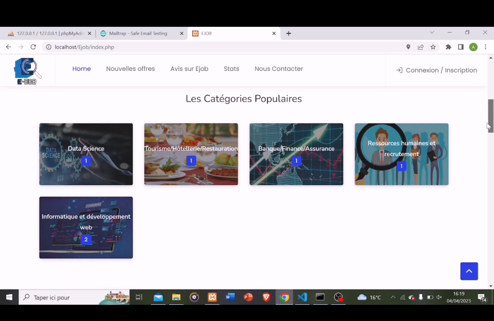
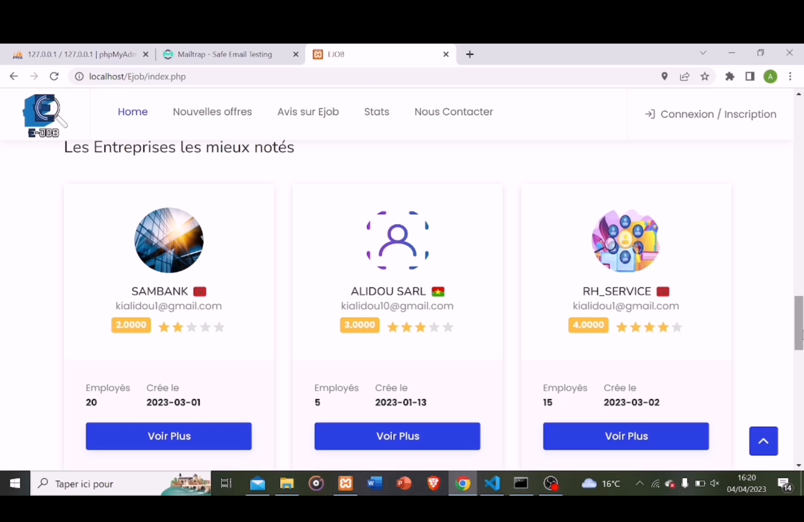
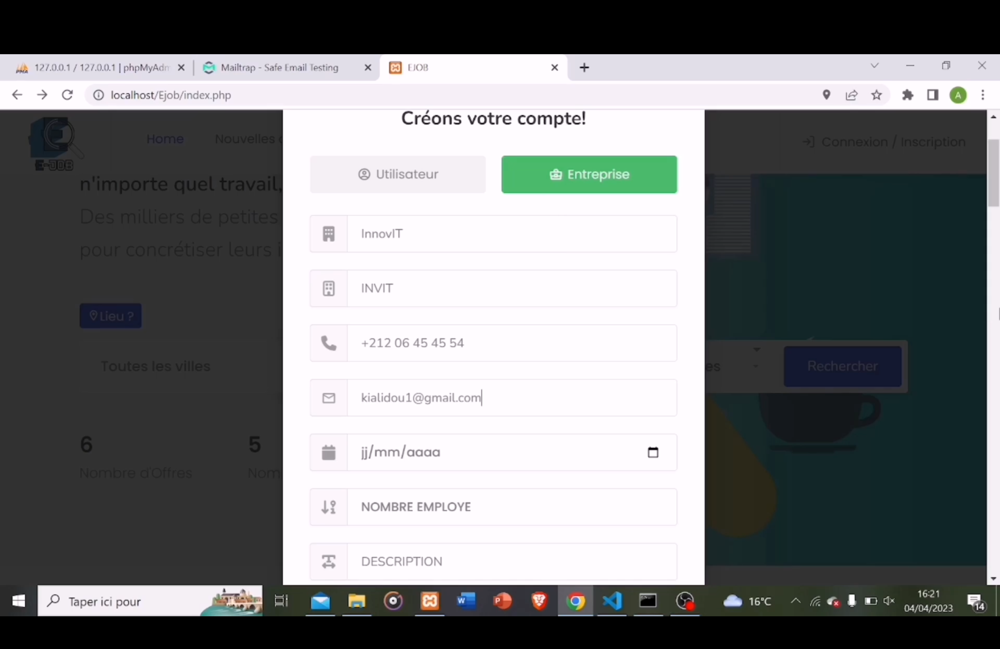
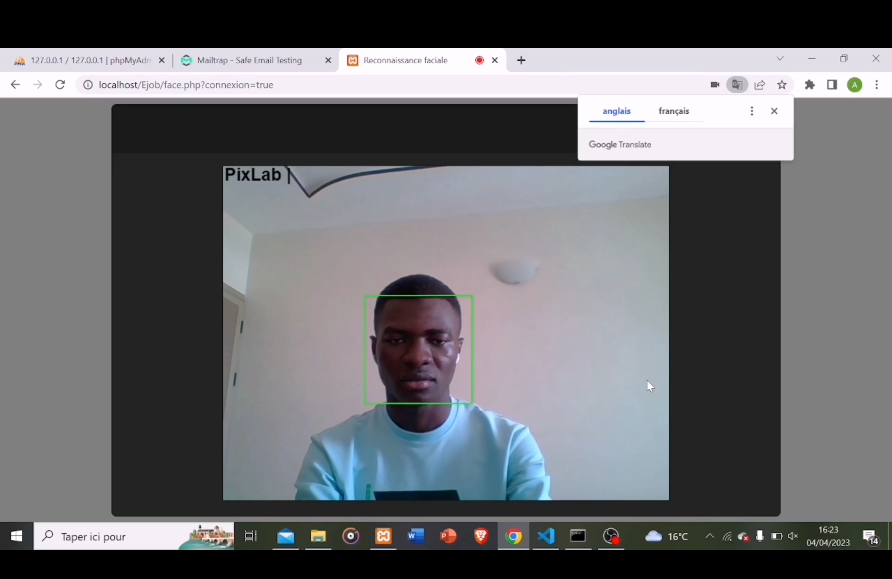
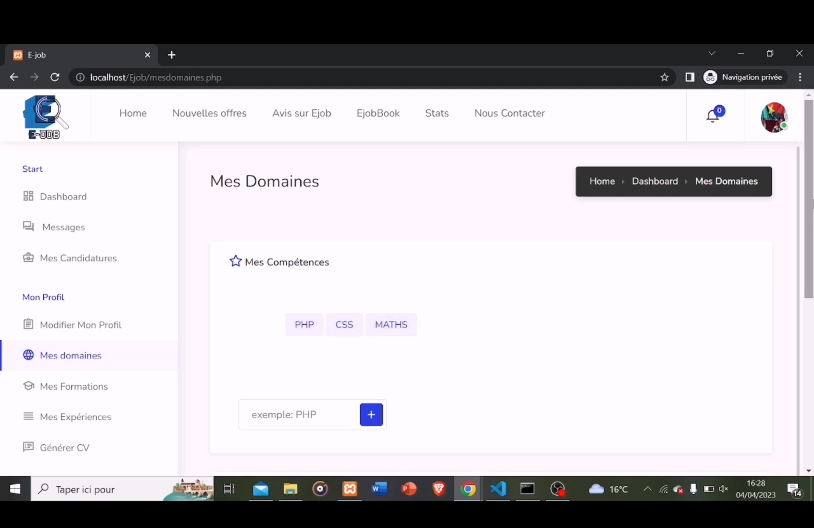
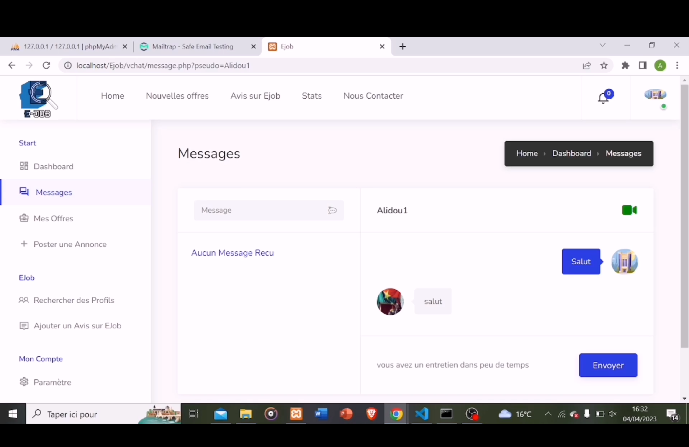
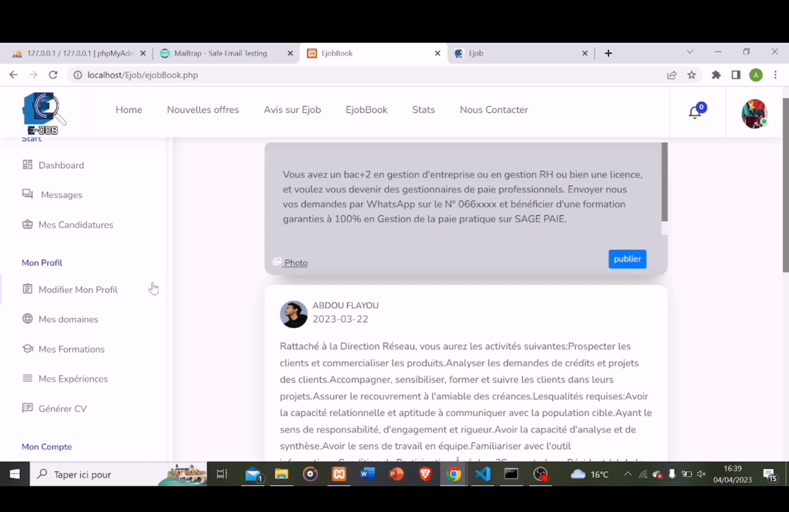
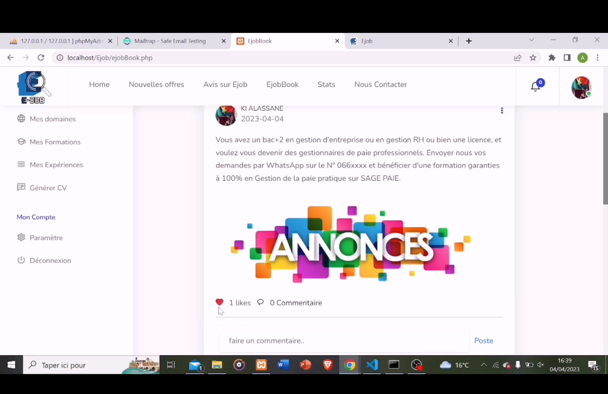
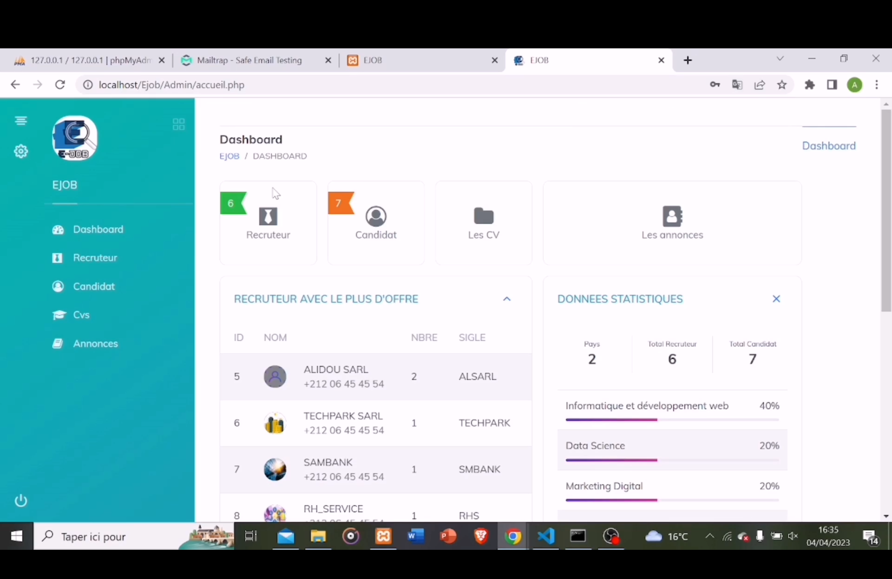

<div align="left"> <a href="./README.md">🇫🇷 Français</a> | <a href="./README.en.md">🇬🇧 English</a> </div>

---

<a name="top"></a>

<div align="center">
  
  
  
  
  
  
  <h1>Plateforme de Recherche d’Emploi — E-job (Projet de fin d’études)</h1> 
  <p>Projet réalisé lors de notre stage de fin d'études à l'École Supérieure de Technologie (EST) de Dakhla.
    — Plateforme web de mise en relation entre candidats et recruteurs avec reconnaissance faciale et entretiens vidéo en temps réel.</p>
</div>

# [Video Démonstration](https://drive.google.com/file/d/1j_fFIZO1UCVzL9FBF4Yu5ooe13vhHvZ8/view?usp=sharing)
Si le lien ne marche pas, considérez de copier lien et de le coller dans la barre de recherche.

# [Rapport](https://drive.google.com/file/d/1ZC3K8jgseLpnp2MA49-s_n1Q64SxVzrX/view?usp=sharing)
Si le lien ne marche pas, considérez de copier lien et de le coller dans la barre de recherche.

## Table des Matières
1. [Introduction](#introduction)
2. [Fonctionnalités Clés](#features)
3. [Technologies Utilisées](#tech)
4. [Installation](#installation)
5. [Améliorations Futures](#future)
6. [Démo](#demo)

---

## Introduction<a name="introduction"></a>

E-job est une plateforme de recherche d’emploi qui met en relation **des entreprises** ayant des postes à pourvoir et **des candidats** en quête d’emploi.  
L’objectif est de **faciliter la recherche d’emploi pour les candidats** tout en **digitalisant le processus de recrutement pour les recruteurs**.  

Le site intègre :
- Une **authentification classique** et **par reconnaissance faciale** (API FaceIO).
- Un **E-jobBook** pour publier, liker et commenter des offres même sans statut d’entreprise.
- Un **tableau de bord** pour chaque profil (candidat / recruteur).
- Un **module d’entretien vidéo en temps réel** grâce à WebRTC.

<div align="right">
  <a href="#top">⬆ Retour en haut</a>
</div>

---

## Fonctionnalités Clés<a name="features"></a>

### 👤 Candidat
- Authentification par **login/mot de passe** ou **reconnaissance faciale**.
- Recherche et consultation d’offres par **mot-clé**, **secteur**, **catégorie**.
- Postuler en ligne et gérer ses candidatures.
- Ajouter formations, expériences, compétences, domaines de préférence.
- Réception automatique d’alertes par mail pour les offres correspondant à ses préférences.
- Génération et téléchargement automatique de CV à partir de modèles prédéfinis.
- Tableau de bord avec statistiques et rappels.
- Interaction sur le module **E-jobBook** (publications, likes, commentaires).

### 🏢 Recruteur
- Authentification classique ou par reconnaissance faciale.
- Publication et gestion d’offres d’emploi.
- Recherche de candidats par compétences ou école.
- Gestion des candidatures (téléchargement de CV, messagerie intégrée).
- Entretiens en visioconférence en temps réel via **WebRTC**.
- Tableau de bord avec statistiques et rappels.

### 🛠️ Administrateur
- Accès à un tableau de bord global.
- Consultation et suppression d’offres, profils, CV non conformes.
- Gestion des statistiques globales de la plateforme.

### 📱 E-jobBook
- Publications libres par les candidats.
- Like et commentaires sur les publications.

<div align="right">
  <a href="#top">⬆ Retour en haut</a>
</div>

---

## Technologies Utilisées<a name="tech"></a>

<div align="center">
  
  
  
  
  
  
</div>

- **Backend** : PHP  
- **Frontend** : HTML5, CSS3, Bootstrap, JavaScript, jQuery, Ajax  
- **Base de données** : MySQL  
- **API** : FaceIO (reconnaissance faciale)  
- **Visioconférence** : WebRTC  
- **Gestion des e-mails** : PHPMailer + Mailtrap  

<div align="right">
  <a href="#top">⬆ Retour en haut</a>
</div>

---

## Installation<a name="installation"></a>

### Prérequis
- XAMPP (Apache, MySQL, PHP ≥ 7)
- Navigateur moderne (Chrome, Firefox, Edge)

### Étapes d’installation
1. **Cloner le dépôt**
   ```bash
   git clone https://github.com/Alidou26/PFE_Ejob.git
   cd PFE_Ejob
   ```
### Configurer la base de données
1. Importer `ejob.sql` dans **phpMyAdmin**.  
2. Modifier les accès dans `BaseDeDonnees.php`.

### Lancer le serveur
1. Démarrer **Apache** et **MySQL** via **XAMPP**.  
2. Accéder à [http://localhost/ejob](http://localhost/ejob).

<div align="right"> <a href="#top">⬆ Retour en haut</a> </div>

---

## Améliorations Futures<a name="future"></a>
- 📱 Développement d’une application mobile (React Native / Flutter).  
- 🔐 Ajout de la double authentification (2FA) et renforcement de la sécurité.  
- ☁️ Déploiement Cloud (AWS, Azure) avec CI/CD.  
- 🤖 Système de matching intelligent via IA pour suggestions d’offres/candidats.  
- 📈 Outils d’analyse avancée pour les recruteurs (tendances, rapports).  
- 🗂️ Gestion documentaire avancée pour les CV.

<div align="right"> <a href="#top">⬆ Retour en haut</a> </div>

---

## Démo<a name="demo"></a>






















<div align="right"> <a href="#top">⬆ Retour en haut</a> </div>

